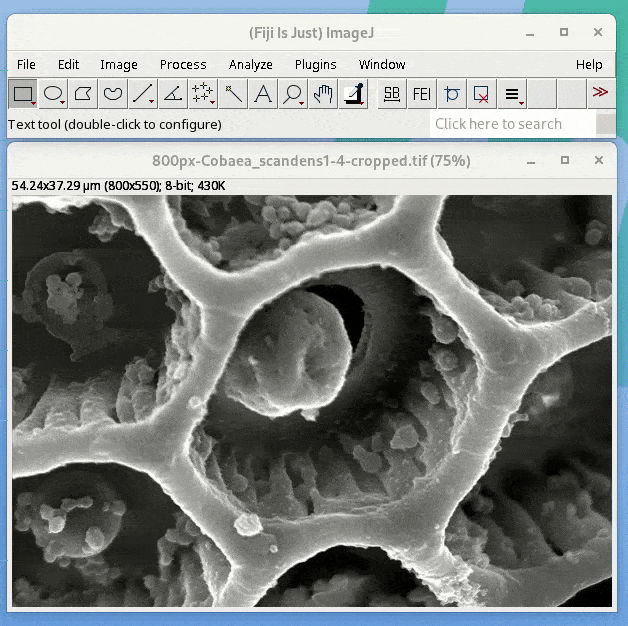
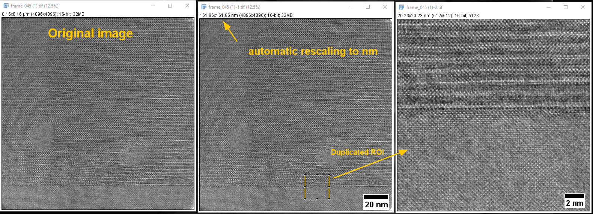
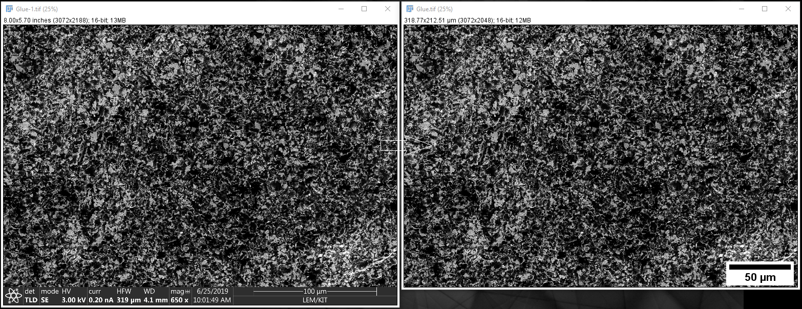
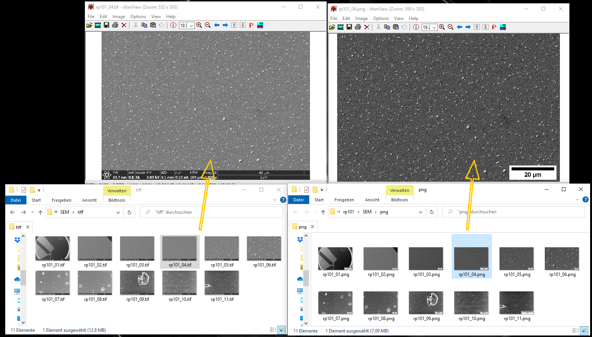
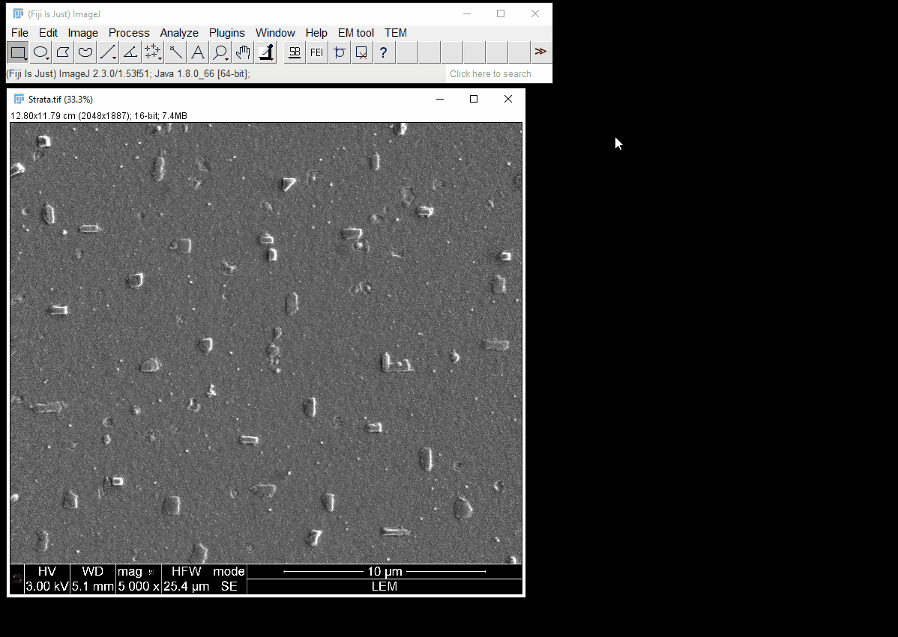

# em-scalebartools

Fiji macro toolset to quickly add a scale bar with reasonable size to an image. Developed for electron microscopy.
| :exclamation:  Please double-check the scale-bar length for possible rounding errors, especially if it shows 1 µm, 1 nm, 1 mm, ... . |
|-----------------------------------------|
  
Image source: Cropped image of [Cobaea scandens](https://commons.wikimedia.org/wiki/File:Cobaea_scandens1-4.jpg) pollen by Marie Majaura from [Wikipedia](https://en.wikipedia.org/wiki/Scanning_electron_microscope).

## Examples

Using QuickScaleBar on a HRTEM image. Note the similar size of the scale bars for the 4096²  image (center) and the cropped 512² ROI image (right).

Using FEI Crop Scalebar on an SEM image.

Batch conversion of SEM images (``Process -> Batch -> Macro...``) from tiff to png using ``FEI_Crop_Scalebar.ijm``.

## EMScaleBarTools in action

Examples are from v0.2.

Basic usage with cropping of a TFS/FEI databar, addition of a scale bar, moving and removing of the scale bar:

The next GIF shows the application of `Auto re-scale images` to upscale a small (in pixels) inset of an image:

The next GIF shows an example workflow when working with presentations (here Microsoft PowerPoint). For a horizontal alignment of images (here an SEM and an HAADF-STEM image) with the same desired image height, the scale bar reference is switched to `Height`. Note the automatic handling of unit-switching and rescaling as in the previous example. The image are then copied via the hotkey c to the system clipboard and pasted into PowerPoint.

## Macro description

##### QuickScaleBar Tool (Icon: <u>SB</u>)

* One-click action to add a scale bar to an image. Right click opens the options menu.

* The scale bar height and font size is adjusted based on image height (or width).

* The scale bar width is adjusted based on scaled image width (or height, or larger/smaller of the two) and rounded to next "good looking" number.

* The scale bar appearance can be set up just like the normal settings for `Analyze -> Tools -> Scale bar...`.

* Optional: Automatically switch units to make scale bar more appealing. E.g., an image with horizontal field width of 0.25 µm will be switched to 250 nm. The scale bar will then also be in nm.

* Optional: Automatically re-scale image to (at least) a specified image size in pixels without interpolation (= nearest neighbor interpolation). This is convenient for programs like PowerPoint which like to automatically interpolate "small" images.

* Optional: Run custom macro commands provided in the options menu, e.g. `run('mpl-viridis');` to change LUT to viridis.

##### FEI Crop Scalebar Tool (Icon: FEI)

* One-click action to crop away the databar from an FEI/TFS SEM/FIB image and to add a scale bar. Right click opens the options menu.

* Scale bar behaviour is the same as for QuickScaleBar tool and settings are taken from the QuickScaleBar options.

* Optional: Run custom macro commands provided in the options menu, e.g. `run('mpl-viridis');` to change LUT to viridis.

* Especially useful for batch conversion of SEM/FIB images (run from `Process -> Batch -> Macro...` ): In the batch processing menu insert the macro command `runMacro('FEI_Crop_Scalebar.ijm');`.

For a description of the other tools, take a look at the [wiki](https://github.com/lukmuk/em-scalebartools/wiki). 🗒

## Requirements and Installation

* Cropping the FEI/TFS info bar requires the useful [EM tool](https://imagej.net/plugins/imbalence) plugin by **IMBalENce**  as FEI/TFS images are scaled with [SEM FEI metadata scale](https://imagej.net/plugins/sem-fei-metadata-scale). Install via the Fiji update site.

* Download the latest [release](https://github.com/lukmuk/em-scalebartools/releases), extract the `macros` folder, and copy it to your Fiji installation folder. It will add the``FEI_Crop_Scalebar.ijm`` macro to the macros folder and the `EMScaleBarTools.ijm` toolset to the `macros/toolset` folder.

* Restart Fiji and select the `EMScaleBarTools` from `More Tools...` (>>) menu. 

* Legacy option for v0.2 and below: [Adding new FEI/TFS microscope types](https://github.com/lukmuk/em-scalebartools/wiki/Adding-new-microscope-types)

## [Documentation](https://github.com/lukmuk/em-scalebartools/wiki)

## [Changelog](https://github.com/lukmuk/em-scalebartools/wiki/Changelog)

## Other useful scalebar tools

* Python: [matplotlib-scalebar](https://github.com/ppinard/matplotlib-scalebar) by ppinard

* DM/GMS: [Scale Bar Control](http://www.dmscripting.com/scalebarcontrol.html) by D. R. G. Mitchell

* Fiji/ImageJ: [asc-ImageJ-Fancy-Labels](https://github.com/peterjlee/asc-ImageJ-Fancy-Labels) by peterjlee

* Fiji/ImageJ: [Scale Bar Tools for Microscopes](http://image.bio.methods.free.fr/ImageJ/?Scale-Bar-Tools-for-Microscopes.html&lang=en) by Gilles Carpentier

## Citing

If you want, you can cite this project via Zenodo:  
  

